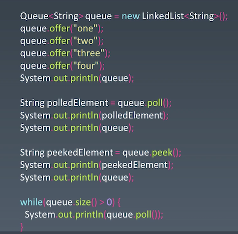
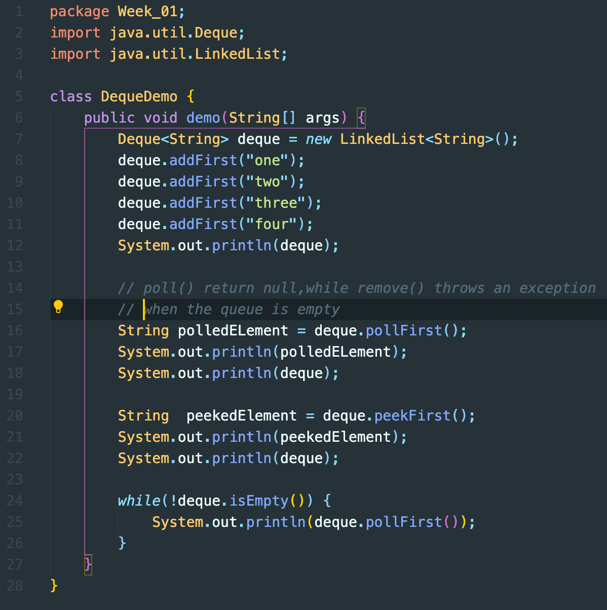

<script type="text/javascript" src="http://cdn.mathjax.org/mathjax/latest/MathJax.js?config=default"></script>
<div style="text-align:center;">
   <h2>
     第一周笔记以及作业
  </h2>
</div>


### 数组ArrayList、链表Linked List、跳表Skip List

+ [Java 源码分析（ArrayList）](http://developer.classpath.org/doc/java/util/ArrayList-source.html)

+ [Linked List 的标准实现代码](http://www.geeksforgeeks.org/implementing-a-linked-list-in-java-using-class/)

+ [Linked List 示例代码](http://www.cs.cmu.edu/~adamchik/15-121/lectures/Linked Lists/code/LinkedList.java)

+ [Java 源码分析（LinkedList）](http://developer.classpath.org/doc/java/util/LinkedList-source.html)
	java的LinkedList实现的是一个双向链表，实现亮点和细节如下：

  + 如何对链表判空：首节点`first == null;`

  - 查找给定`index下标`的元素，首先判断下标位置是在链表前半段还是后半段，再决定从头部还是尾部开始查找。

    ```java
    Entry<T> getEntry(int n) {
      Entry<T> e;
      if (n < size / 2) {
      	e = first;
      	// n less than size/2, iterate from start
      	while (n-- > 0)
      		e = e.next;
      } else {
      	e = last;
      	// n greater than size/2, iterate from end
      	while (++n < size)
      		e = e.previous;
      }
      return e;
    }
    ```

相关应用：LRU缓存机制——LinkedList、Redis——Skip List

> 跳表Skip List仅仅适用于元素有序的情况下，通过有序这个额外信息构造出更高维度的信息结构实现加速查找复杂度是O(logn)。但是代价是删除插入的时间复杂度也会从O(1)上升到O(logn)。

LRU缓存机制:双向链表 + 哈希查找

```java
package Week_01;

import java.util.HashMap;
import java.util.Map;

/*
 * @lc app=leetcode.cn id=146 lang=java
 *
 * [146] LRU缓存机制
 */

// @lc code=start
class LRUCache {
    int size;
    int cap;
    // 伪头部，尾部——避免插入到头部和尾部使得判断
    DLinkedNode head;
    DLinkedNode tail;
    Map<Integer, DLinkedNode> cache = new HashMap<Integer, DLinkedNode>();
    public LRUCache(int capacity) {
        cap = capacity;
        size = 0;
        head = new DLinkedNode();
        tail = new DLinkedNode();
        head.next = tail;
        tail.pre = head;
    }
    
    public int get(int key) {
        DLinkedNode node = cache.get(key);
        if (node == null) {
            return -1;
        }
        if (node != head.next) {
            removeEntry(node);
            addFirst(node);
        }
        return node.value;
    }
    public void put(int key, int value) {
        DLinkedNode node = cache.get(key);
        if (node == null) {
            DLinkedNode dLinkedNode = new DLinkedNode(key, value);
            cache.put(key, dLinkedNode);
            if (size == cap) {
                cache.remove(tail.pre.key);
                removeEntry(tail.pre);
            }
            addFirst(dLinkedNode);
        }
        else {
            node.value = value;
            removeEntry(node);
            addFirst(node);
        }
    }


    void addFirst(DLinkedNode dLinkedNode) {
        dLinkedNode.next = head.next;
        dLinkedNode.pre = head;
        head.next.pre = dLinkedNode;
        head.next = dLinkedNode;
        size ++;
    }

    
    void removeEntry(DLinkedNode dLinkedNode) {
        dLinkedNode.pre.next = dLinkedNode.next;
        dLinkedNode.next.pre = dLinkedNode.pre;
        size --;
    }

    private static final class DLinkedNode {
        int key;
        int value;
        DLinkedNode next;
        DLinkedNode pre;
        DLinkedNode (int k, int v) {
            key = k;
            value = v;
        }
        DLinkedNode () {
            
        }
    }
}

/**
 * Your LRUCache object will be instantiated and called as such:
 * LRUCache obj = new LRUCache(capacity);
 * int param_1 = obj.get(key);
 * obj.put(key,value);
 */
// @lc code=end
```


### 刷题策略之五毒神掌

1. 五分钟看题和思考
2. 有思路，尝试写
3. 无思路，直接看题解
4. 背诵，默写
5. 闭卷，自己写

### 栈和队列的实现与特性

养成通过谷歌查找各编程语言数据结构原生实现的习惯，例如：直接google java + Stack。

**参考链接**

- [Java 的 PriorityQueue 文档](http://docs.oracle.com/javase/10/docs/api/java/util/PriorityQueue.html)
- [Java 的 Stack 源码](http://developer.classpath.org/doc/java/util/Stack-source.html)
- [Java 的 Queue 源码](http://fuseyism.com/classpath/doc/java/util/Queue-source.html)
- [Python 的 heapq](http://docs.python.org/2/library/heapq.html)
- [高性能的 container 库](http://docs.python.org/2/library/collections.html)

### 作业

- 用 add first 或 add last 这套新的 API 改写 Deque 的代码:[source](./DequeDemo.java)
  
  <div style="display:table;">
    <div style="display:table-cell;width:45%;">
      
    </div>
    <div style="display:table-cell;width:55%;">
      
    </div> 
  </div>
  
  
- 分析 Queue 和 Priority Queue 的源码

  **Java源码**：

  Java实现的Priority Queue 类内部的有三个变量，存储数据的数组storage(实际上存储的最小堆)，在队列元素个数used，以及一个比较函数comparator。在添加和删除首元素的时候，重新维护成最小堆。

- [设计循环双端队列](https://leetcode.com/problems/design-circular-deque)（Facebook 在 1 年内面试中考过）

  **数组实现**

  ```java
  package LeetCode;
  
  /*
   * @lc app=leetcode.cn id=641 lang=java
   *
   * [641] 设计循环双端队列
   */
  
  // @lc code=start
  class MyCircularDeque {
      int limit;
      int size;
      int[] arr;
      /** Initialize your data structure here. Set the size of the deque to be k. */
      public MyCircularDeque(int k) {
          limit = k;
          size = 0;
          arr = new int[k];
      }
      
      /** Adds an item at the front of Deque. Return true if the operation is successful. */
      public boolean insertFront(int value) {
          if (size == limit) return false;
          for(int i = size;i > 0;i --) arr[i] = arr[i-1];
          arr[0] = value;
          size ++;
          printArr();
          return true;
      }   
      
      /** Adds an item at the rear of Deque. Return true if the operation is successful. */
      public boolean insertLast(int value) {
          if (size == limit) return false;
          arr[size++] = value;
          printArr();
          return true;
      }
      
      /** Deletes an item from the front of Deque. Return true if the operation is successful. */
      public boolean deleteFront() {
          if (size == 0) return false;
          for (int i = 0;i < size-1;i ++) arr[i] = arr[i + 1];
          --size;
          return true;
      }
      
      /** Deletes an item from the rear of Deque. Return true if the operation is successful. */
      public boolean deleteLast() {
          if (size == 0) return false;
          size --;
          return true;
      }
      
      /** Get the front item from the deque. */
      public int getFront() {
          if (size == 0) return -1;
          return arr[0];
      }
      
      /** Get the last item from the deque. */
      public int getRear() {
          if (size == 0) return -1;
          return arr[size-1];
      }
      
      /** Checks whether the circular deque is empty or not. */
      public boolean isEmpty() {
          return size == 0;
      }
      
      /** Checks whether the circular deque is full or not. */
      public boolean isFull() {
          return size == limit;
      }
      public void printArr() {
          System.out.print("[ ");
          for(int i = 0;i < arr.length;i ++){
              System.out.print(arr[i]);
              System.out.print(" ");
          }
          System.out.print("]");
      }
  }
  ```

  

  **双向链表实现**

  ```java
  
  /*
   * @lc app=leetcode.cn id=641 lang=java
   *
   * [641] 设计循环双端队列
   */
  
  // @lc code=start
  class MyCircularDeque{
      int limit;
      int size;
      Node hNode;
      /** Initialize your data structure here. Set the size of the deque to be k. */
      public MyCircularDeque(int k) {
          limit = k;
          size = 0;
          hNode = null;
      }
      
      /** Adds an item at the front of Deque. Return true if the operation is successful. */
      public boolean insertFront(int value) {
          if (size == limit) return false;
          if (hNode == null) {
              hNode = new Node(value);
              hNode.pre = hNode;
              hNode.next = hNode;
              size ++;
              printArr();
              return true;
          } 
          Node node = new Node(value);
          node.next = hNode;
          node.pre = hNode.pre;
          hNode.pre.next = node;
          hNode.pre = node;
          hNode = node;
          size ++;
          printArr();
          return true;
      }   
      
      /** Adds an item at the rear of Deque. Return true if the operation is successful. */
      public boolean insertLast(int value) {
          if (size == limit) return false;
          if (hNode == null) {
              hNode = new Node(value);
              // hNode.val = value;
              hNode.pre = hNode;
              hNode.next = hNode;
              size ++;
              printArr();
              return true;
          } 
          Node node = new Node(value);
          hNode.pre.next = node;
          node.pre = hNode.pre;
          hNode.pre = node;
          node.next = hNode;
          size ++;
          printArr();
          return true;
      }
      
      /** Deletes an item from the front of Deque. Return true if the operation is successful. */
      public boolean deleteFront() {
          if (hNode == null) return false;
          if (size == 1) {
              hNode = null;
              size = 0;
              return true;
          }
          hNode.next.pre = hNode.pre;
          hNode.pre.next = hNode.next;
          hNode = hNode.next;
          size --;
          return true;
      }
      
      /** Deletes an item from the rear of Deque. Return true if the operation is successful. */
      public boolean deleteLast() {
          if (hNode == null) return false;
          if (size == 1) {
              hNode = null;
              size = 0;
              return true;
          }
          hNode.pre = hNode.pre.pre;
          hNode.pre.next = hNode;
          size --;
          return true;
      }
      
      /** Get the front item from the deque. */
      public int getFront() {
          if (hNode == null) return -1;
          return hNode.val;
      }
      
      /** Get the last item from the deque. */
      public int getRear() {
          if (hNode == null) return -1;
          return hNode.pre.val;
      }
      
      /** Checks whether the circular deque is empty or not. */
      public boolean isEmpty() {
          return size == 0;
      }
      
      /** Checks whether the circular deque is full or not. */
      public boolean isFull() {
          return size == limit;
      }
      public void printArr() {
          if (hNode == null) return;
          System.out.print("[ ");
          Node tmp1 = hNode,tmp2 = hNode.next;
          System.out.print(tmp1.val);
          System.out.print(",");
          while(tmp2 != tmp1){
              System.out.print(tmp2.val);
              System.out.print(",");
              tmp2 = tmp2.next;
          }
          System.out.print("]");
      }
  }
  class Node {
      int val;
      Node pre;
      Node next;
      Node(int value) {
          val = value;
          pre = null;
          next = null;
      }
  }
  /**
   * Your MyCircularDeque object will be instantiated and called as such:
   * MyCircularDeque obj = new MyCircularDeque(k);
   * boolean param_1 = obj.insertFront(value);
   * boolean param_2 = obj.insertLast(value);
   * boolean param_3 = obj.deleteFront();
   * boolean param_4 = obj.deleteLast();
   * int param_5 = obj.getFront();
   * int param_6 = obj.getRear();
   * boolean param_7 = obj.isEmpty();
   * boolean param_8 = obj.isFull();
   */
  // @lc code=end
  ```

- [接雨水](https://leetcode.com/problems/trapping-rain-water/)（亚马逊、字节跳动、高盛集团、Facebook 在半年内面试常考）

  每一根柱子之上的积水区都是左右两边最近的更高的柱子包裹起来的，如果左右两边至少一边没有比该根柱子更高的柱子，那么上方就不会有积水。我们可以用一个leftPos数组和一个rightPos数组保存每根柱子左右两边最近的高于自己的柱子的下标，找不到就设为-1。则第i根柱子上方的积水体积为：

  <script type="text/javascript" src="http://cdn.mathjax.org/mathjax/latest/MathJax.js?config=default"></script>
  
  $$x=\frac{-b\pm\sqrt{b^2-4ac}}{2a}$$\\(x=\frac{-b\pm\sqrt{b^2-4ac}}{2a}\\)
  $$ { (leftPos[i] = -1 or rightPos[i] = -1}
  S[i] =
  $$
  **```**
  
  ```
  $$x=\frac{-b\pm\sqrt{b^2-4ac}}{2a}$$\\(x=\frac{-b\pm\sqrt{b^2-4ac}}{2a}\\)
  ```
  
  **```**
  
  
  
  

