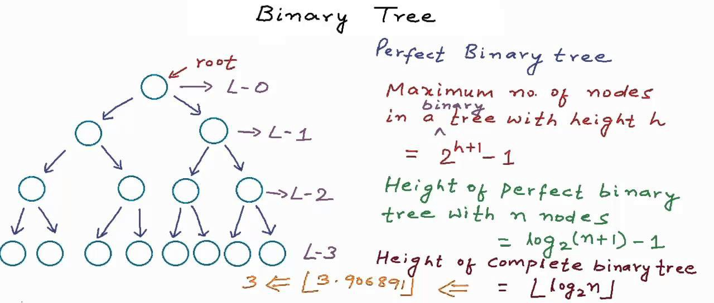

<div>
  
</div>

二叉树三种遍历的递归和迭代实现

### 前序遍历：

递归：

```java
class Solution {
    public List<Integer> preorderTraversal(TreeNode root) {
        if (root == null) return new ArrayList<Integer>();
        ArrayList<Integer> list = new ArrayList<>();
        list.add(root.val);
        list.addAll(preorderTraversal(root.left));
        list.addAll(preorderTraversal(root.right));
        return list;
     }
}
```

迭代：

```java
class Solution {
    public List<Integer> preorderTraversal(TreeNode root) {
        ArrayList<Integer> list = new ArrayList<>();
        Stack<TreeNode> stack = new Stack<TreeNode>();
        TreeNode cur = root;
        while(!stack.isEmpty() || cur != null) {
            while(cur != null) {
                stack.push(cur);
                list.add(cur.val);
                cur = cur.left;
            }
            cur = stack.pop();
            cur = cur.right;
        }
        return list;
    }
}
```

### 中序遍历

递归：

```java
class Solution {
    public List<Integer> inorderTraversal(TreeNode root) {
        if (root == null) {
            return new ArrayList<Integer>();
        }
        ArrayList<Integer> list = new ArrayList<Integer>();
        list.addAll(inorderTraversal(root.left));
        list.add(root.val);
        list.addAll(inorderTraversal(root.right));
        return list;
    }
}
```

迭代：

```java
class Solution {
    public List<Integer> inorderTraversal(TreeNode root) {
        if (root == null) return new ArrayList<Integer>(); 
        Stack<TreeNode> stack = new Stack<>();
        List<Integer> list = new ArrayList<Integer>();
        TreeNode curNode = root;
        while (!stack.isEmpty() || curNode != null) {
            while(curNode != null) {
                stack.push(curNode);
                curNode = curNode.left;
            }
            curNode = stack.pop();
            list.add(curNode.val);
            curNode = curNode.right;
        }
        return list;
    }
}
```

### 后序遍历

递归：

```java
class Solution {
    public List<Integer> postorderTraversal(TreeNode root) {
        if (root == null) {
            return new ArrayList<Integer>();
        }
        ArrayList<Integer> list = new ArrayList<Integer>();
        list.addAll(postorderTraversal(root.left));
        list.addAll(postorderTraversal(root.right));
        list.add(root.val);
        return list;
    }
}
```

迭代：

伪代码：

```bash
iterativePostorder(node)
  s ← empty stack
  lastNodeVisited ← null
  while (not s.isEmpty() or node ≠ null)
    if (node ≠ null)
      s.push(node)
      node ← node.left
    else
      peekNode ← s.peek()
      // if right child exists and traversing node
      // from left child, then move right
      if (peekNode.right ≠ null and lastNodeVisited ≠ peekNode.right)
        node ← peekNode.right
      else
        visit(peekNode)
        lastNodeVisited ← s.pop()
```

```java
class Solution {
    public List<Integer> postorderTraversal(TreeNode root) {
        if (root == null) return new ArrayList<Integer>(); 
        Stack<TreeNode> stack = new Stack<>();
        LinkedList<Integer> list = new LinkedList<Integer>();
        TreeNode curNode = root;
        stack.push(curNode);
        while (!stack.isEmpty()) {
            curNode = stack.pop();
            list.addFirst(curNode.val);
            if (curNode.left != null) {
                stack.push(curNode.left);
            }
            if (curNode.right != null) {
                stack.push(curNode.right);
            }
        }
        return list;
    }
}
```

