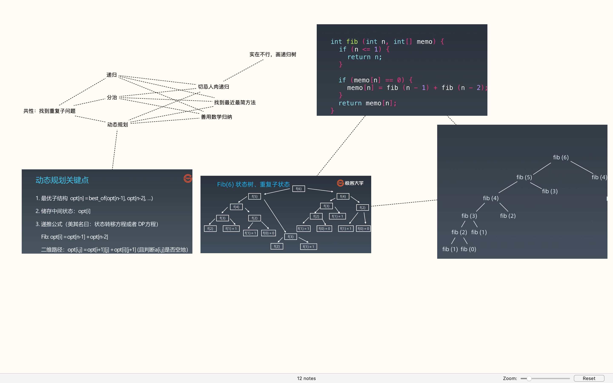

动态规划、分治、递归的共性——找到重复子问题

### 动态规划解题方法

1. 尝试找到最优子结构 （最难：很多时候虽然知道方向，但就是想不到）
2. 存储中间状态
3. 递推公式

<div>
  
</div>

### 一道状态压缩和dp

[Parallel Courses II - LeetCode](https://leetcode.com/problems/parallel-courses-ii/)

首先说一下这道题学到的点：

1. 状态压缩的处理——位运算
2. 如何通过递归处理组合数 $C m^n$
3. 看似无法用动态规划的dp和零钱兑换差不多

```python
class Solution:
    def minNumberOfSemesters(self, n: int, dependencies: List[List[int]], k: int) -> int:
        def dfs(x, m, k, step, state, course):
            if m - x < k: 
                return
            if x >= m or k == 0:
                if dp[state] == -1 or dp[state] > step:
                    dp[state] = step
            else:
                dfs(x+1, m, k-1, step, state | (1 << course[x]), course)
                dfs(x+1, m, k, step, state, course)

        # 状态压缩表示必须先上的课 pre[2] = 11100010 （从低位到高位）表示课程2之前第1，5，6，7门课需要先上
        pre_class = [0] * (n+1)
        # dp[state]表示上完状态为state的课最少需要几个学期
        dp = [-1]*(1 << 16)  
        dp[0] = 0
        for d in dependencies:
            pre_class[d[1]] |= 1 << d[0]
        lmt = 1 << (n+1)
        for s in range(lmt):
            # 状态不存在，还没有这种上课方式
            if dp[s] == -1: continue
            queue = []
            for i in range(1, n+1):
                # 这门课上过了
                if (s >> i)&1 == 1: continue
                # 先修课没有全部修完
                if (s & pre_class[i]) != pre_class[i]: continue
                queue.append(i)
            m = len(queue)
            dfs(0, m, min(m, k), dp[s] + 1, s, queue)
        return dp[lmt-2]
```

